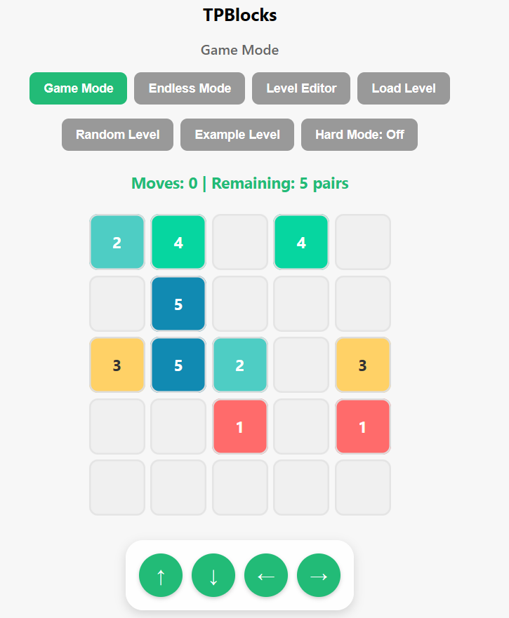

TPBlocks

Game demo page: 
https://sdsds222.itch.io/tpblocks

https://sdsds222.github.io/TPBlocks/

Videos:

[https://www.youtube.com/watch?v=EcubvqxEzGI&t=28s](https://youtu.be/EVvDsldqYJE)

https://www.bilibili.com/video/BV163HKzREBt

TPBlocks is a unique puzzle elimination game.

Blocks can slide and teleport through same-numbered teleport blocks to the other side of the board.

Players must use teleportation, movement, blocking, and chain reactions to cleverly eliminate all blocks and clear the level.

Key Features:

Innovative Teleport Mechanic: Blocks enter one teleport and exit another, triggering chain reactions.

Strategic Puzzle: Movement order and teleport paths determine success.

Level Editor: Create your own levels and challenge friends.

Online Demo: https://sdsds222.github.io/TPBlocks/

Rules and Details: 假设有方块1一对，方块2一对，方块3一对，其中一个方块1可以上下左右滑动一格，但是落点必须有另一个传送方块，不能向空格移动！，如果1向右滑动，右边有一个方块另一个方块是其中一个2或者其中一个3，那么传送滑出到另一个2或者3的右边；如果1上滑且上面有一个方块2或者3，那么也是一样的道理，传送到对应的另一个2或者3的上面，以此类推，上下左右皆可传送。方块都是成对出现的，比如有两个1，两个2，两个3等。方块都是数字标记的，同数字的方块相当于一对传送门。方块不能滑出边界。棋盘为5x5，方块的传送具有传递性，举例子：2向左滑动，左边有1，那么从另一个1方块的左侧向左滑出，但是另一个1方块左侧有3，
所以继续传送到另一个3方块的左侧并向左滑出，这就是传递链。通过条件，消除所有方块，同数字的方块碰在一起可以泯灭，因为一对对应的传送门不能传送自身一样，举例：若3右边是另一个3方块，那么3向右滑动则两个3方块均消除，但是3和3只是挨在一起没有滑动重叠则不消除。注意：不能向空格滑动！但是通过传送后落点可以是空方块。关于边界问题，假设1的左边就是边界了，2滑向另一个1，即传送到1的左侧，但1左侧是边界，那么1向右侧移动为2腾出空间，2即可到达1的左侧；若1无法向右侧移动，即无法发生传送，即2无法向左侧的另一个1滑动，并卡住阻挡。问题：例如：1行2列是4，1行3列是1，3行3列是2，3行4列是另一个2，3行5列是另一个1，如果将4向右滑动那么会传送到3行5列，然后原先在3行5列的1会为了腾出空间向右移动，进入2，最后从3行2列出现，从3行3列的2滑出，
